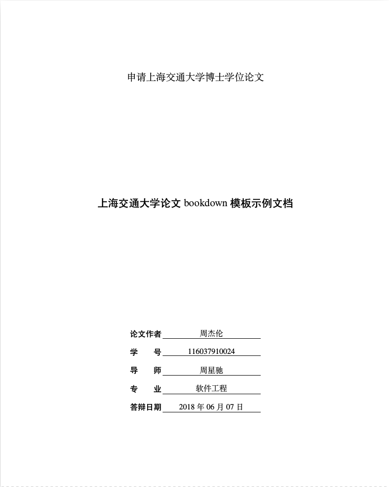

# SJTUThesis-Markdown

上海交通大学学位论文 R Markdown (bookdown) 模板，示例文档可见 [SJTUThesis.pdf](https://dongyueweb.com/SJTUThesis-Markdown/SJTUThesis.pdf)。

## 效果展示

    

## 如何使用

请见[使用文档](./documentation/user.md)

## 如何贡献

请见[开发者指南](./documentation/dev.md)

## 致谢

- 感谢 [sjtug/SJTUThesis](https://github.com/sjtug/sjtuthesis) 维护了交大学位论文的 XeLaTeX 模板
- 感谢 [RStudio/bookdown](https://github.com/rstudio/bookdown) 提供了使用 R Markdown 进行文档编辑的可能
- 感谢 [bubifengyun/SJTUThesis-Rmd](https://github.com/bubifengyun/SJTUThesis-Rmd) 首先实现了交大论文的 R Markdown 的模板
